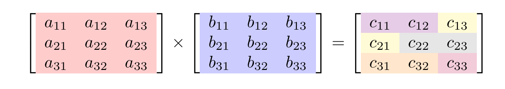

# Multithread matrix

## Ogólne informacje
W ramach biblioteki zaimplementowano algorytm do wielowątkowego mnożenia macierzy w języku Rust, a następnie funkcję go implementującą wystawiono w formie biblioteki po stronie języka Python.

Do wystawienia funkcji po stronie Pythona wykorzystano bibliotekę [PyO3](https://pyo3.rs/v0.21.2/).

## Instalacja pakietu pythonowego
W katalogu projektu z plikiem `pyproject.toml` wykonujemy następującą komendę:
```bash
pip3 install .
```
> Jeżeli chcemy zainstalować pakiet w środowisku wirtualnym, należy najpierw aktywować środowisko. Dla środowiska wirtualnego utworzonego z wykorzystaniem `anaconda` należy najpierw stworzyć środowisko komendą `conda create env -n <nazwa>`, a następnie aktywować je `conda activate <nazwa>`

## Algorytm
Zamiast standardowego algorytmu mnożenia macierzy w ramach którego jeden wątek oblicza wartości wszystkich elementów macierzy wyjściowej, zastosowano algorytm w ramach którego w zależności od ilości użytych wątków oraz wielkości macierzy wyjściowej do każdego wątku przydzielane jest `n` elementów do obliczenia.

Poniżej na rysunku przedstawiono mnożenie dwóch macierzy kwadratowych o wymiarach 3x3 przy użyciu 4 wątków. Kolor tła elementów macierzy `C` oznacza który wątek jest odpowiedzialny za obliczenie wartości tego elementu.



W sytuacji w której liczba elementów macierzy `C` jest podzielna przez liczbę wątków to do każdego wątku przydzielana jest taka sama liczba elementów.

W przeciwnym przypadku wynik takiego dzielenia jest zaokrąglany w górę. Np dla macierzy mnożenia macierzy 5x5 przy wykorzystaniu 7 wątków otrzymujemy 4 elementy na wątek. Pierwsze 6 wątków oblicza więc po 4 elementy, a ostatni 7 wątek oblicza tylko jeden element.

Jeżeli podana liczba wątków przewyższa liczbę elementów macierzy wyjściowej to wykorzystywane jest tyle wątków ile elementów tej macierzy.
## Interfejs i przykłady użycia
Biblioteka dostarcza funkcje zarówno po stronie Rust'a, jak i Pythona.

Po stronie pythona funkcja biblioteczna ma następujący interfejs.
```python
def multiply_f64(a: np.ndarray, b: np.ndarray, num_threads=None) -> np.ndarray:
    """
    Multiplies two matrices of type float64 using multiple threads for parallel computation.

    :param a: First matrix, a 2D NumPy array of type float64.
    :param b: Second matrix, a 2D NumPy array of type float64.
    :param num_threads: Optional; The number of threads to use for the computation.
                        If None, the function will use that number of threads provided by the hardware CPU.
    :return: The result of the matrix multiplication as a 2D NumPy array of type float64.
    :raises ValueError: If the number of columns in the first matrix does not match the number of rows in the second matrix.
    :raises TypeError: If the input arrays are not of type float64.
    """
    pass
```
> UWAGA!
> 
> 1. Funkcja przyjmuje tylko macierze zawierajace liczby zmiennoprzecinkowe.
> 2. Mnożenie wektorów także wymaga zdefiniowania macierzy z użyciem biblioteki numpy. Mnożenie elementów `1D array` nie jest wspierane.

### Przykładowe użycie

**Mnożenie macierzy**
```python
import numpy as np
import multithread_matrix as mm
x = np.array([[1, 2], [3, 4]], dtype=np.float64)
y = np.array([[1, 2], [3, 4]], dtype=np.float64)
z = mm.multiply_f64(x, y, num_threads=2)
```

**Mnożenie wektorów**
```python
import numpy as np
import multithread_matrix as mm
x = np.array([1, 2, 3, 4], dtype=np.float64)
y = np.array([5, 6, 7, 8], dtype=np.float64).T
z = mm.multiply_f64(x, y, num_threads=2)
```

Wywołanie przykładów
```bash
python3 python_examples/matrix_mult_performance.py
```

## Wydajność

Przykadowy rezultat programu:
```text
Available CPU's: 16

"Tiny" matrices 2x2
Single threaded: 633ns
Multi threaded: 195.685µs

"Small" matrices 25x25
Single threaded: 21.479µs
Multi threaded: 431.647µs

"Medium" matrices 100x100
Single threaded: 1.20699ms
Multi threaded: 1.424453ms

"Large" matrices 1000x1000
Single threaded: 1.802089957s
Multi threaded: 510.154303ms

"Enormous" matrices 2000x2000
Single threaded: 44.159244698s
Multi threaded: 6.022341037s
```
> Rezultat wywołania programu `rust_examples/main.rs` może się różnić za każdym razem. Jest on zależny od liczby użytych wątków, maszyny, na której jest uruchamiany, oraz aktualnego obciążenia i częstotliwości pracy CPU.


## Biblioteka w języku Rust
Uruchamianie testów jednostkowych w katalogu projektu
```bash
cargo test
```

Uruchomienie przykładów w Rust
```bash
cargo run --release --package multithread_matrix --bin multithread_matrix_bin
```